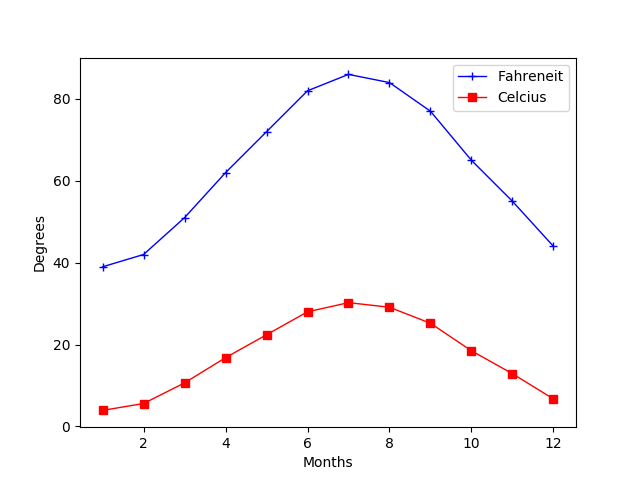

# Legendary Temperature

## Instructions

* Modify the New Jersey temperature line charts from earlier so that they match the image provided.

* Once the plot has been created, look through the [Matplotlib documentation](https://matplotlib.org/2.0.2/index.html) to see what additional formatting could be added to the chart.

- - - 

© 2019 Trilogy Education Services
